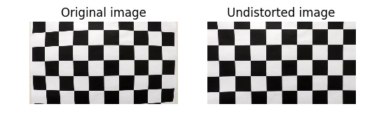
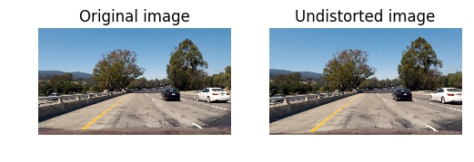
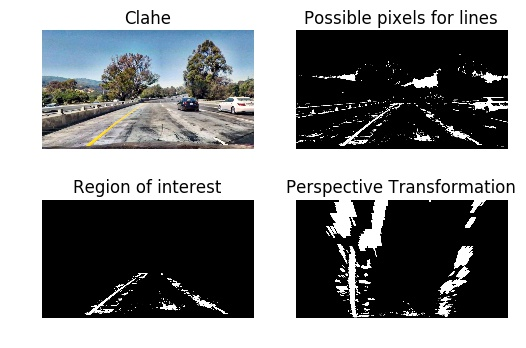
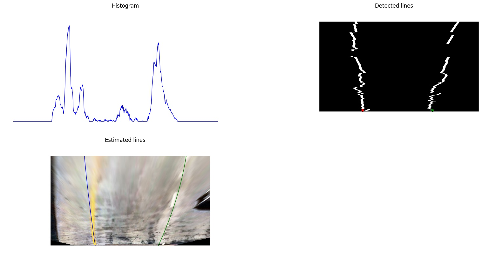
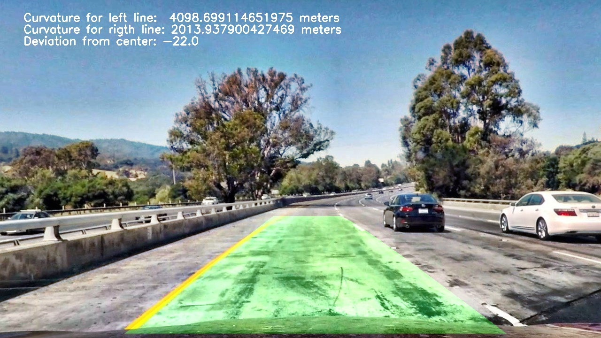

# Advanced Lane Finding Project

The goal of this project is to build a software pipeline to identify the lane boundaries in a video.

The pipeline will contain following steps:

* Compute the camera calibration matrix and distortion coefficients given a set of chessboard images.
* Apply a distortion correction to raw images.
* Use color transforms, gradients, etc., to create a thresholded binary image.
* Apply a perspective transform to rectify binary image ("birds-eye view").
* Detect lane pixels and fit to find the lane boundary.
* Determine the curvature of the lane and vehicle position with respect to center.
* Warp the detected lane boundaries back onto the original image.
* Output visual display of the lane boundaries and numerical estimation of lane curvature and vehicle position.

Results of every step can be found [here](Research.ipynb)

Video can be found [here](https://www.youtube.com/watch?v=UJmm_oLm6lk)

## Camera calibration and correction for distortion

Images for camera calibration can be found [here](camera_cal/)

To calibrate the camera we will use `findChessboardCorners` and `calibrateCamera` functions from OpenCV. [cell#2-8]

Example of correction for distortion:



After we calibrated the camera we can apply a distortion correction to [test images](test_images/) to get [undistorted images](output_images/) [cell#9]


## Line detection
Now we need to find lines on the image, for that we will use following steps:

* Improve contrast in the image with [CLAHE](https://en.wikipedia.org/wiki/Adaptive_histogram_equalization) [cell#25]
* Extract white pixels from RGB image [cell#15]
* Extract yellow pixels from HSV image [cell#16]
* Combine white and yellow pixels [cell#17]
* Extract region of interest from combined image [cell#12]
* Perform Perspective Transformation [cell#30-31]

Result:



Parameters for perspective transformation

| Source        | Destination   |
|:-------------:|:-------------:|
|  475, 548     | 350, 600      |
|  875, 548     | 940, 600      |
| 1200, 712     | 940, 720      |
|  250, 712     | 350, 720      |

* Find centers of the lines [cell#13]
* Extract pixels for the lines [cell#14]
* Calculate coefficients for the lines [cell#19]

Estimated lines:



* Fill a polygon using lines and undo perspective transformation [cell#38]
* Add information about the line curvature and deviation from the center [cell#39]

Result:



Video can be found [here](https://www.youtube.com/watch?v=UJmm_oLm6lk)

After all experiments, we can combine all steps into a python module for line detection: `advance_lane_finding.py`

This is how we can process a video with new module:
```
import advance_lane_finding as alf

# camera calibration

clb = alf.CameraCalibrator((1280, 720))
clb.load_images('camera_cal/*.jpg')
clb.match_points(9, 6)
clb.calibrate()

lf     = alf.LaneFinder((1280, 720), clb)
clip   = VideoFileClip('project_video.mp4')
output = clip.fl_image(lf.process_image)
output.write_videofile('output_video/project_video.mp4', audio=False)
```

## Discussion

After we've built the pipeline and process the video, we can disscuss what problems we faced in the process.

One of them is lines in the middle of the lane, which can lead to false detection of lines centers. To avoid it, we remove a middle of the histogram from the scan.

Another problem is a noise added by shadows and other cars close to lines, which can affect directions of detected lines. For this, we scan only a limited horizontal window, so center of mass couldn't change too fast.

Though the solution is quite stable on presented video, deeply curved roads and other vehicles on the lanes still can cause a problem. It might be more beneficial to use current solution for generating labeled data for training a deep neural network for lane detection.
